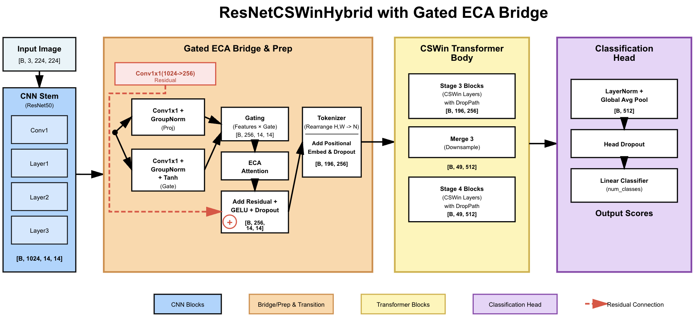

# Efficient multiscale computer vision targeting and evidence-based response to crop diseases - Group 4
Data used can be found on the Google Drive. Download the zipped file you find there.  
 After unzipping it, you should have 2 folders : `2019` and `2022`. Take those 2 and put them in the `current_data` folder.  
 Afterward, go to `prepare_datasets` folder and run everything from there except `get_mean_std_for_normalization.py`. These will split the data as needed for all our cases to make direct comparisons with the paper.
  

## Dataset overview
| Dataset Year | Class Description | Label | Image Count | Dimensions |
| :--- | :--- | :---: | :---: | :---: |
| **2019** | Not *Alternaria Solani* | 0 | 1,710 | 256x256x3 |
| | *Alternaria Solani* | 1 | 2,795 | 256x256x3 |
| **2022** | Not *Alternaria Solani* | 0 | 2,130 | 256x256x3 |
| | *Alternaria Solani* | 1 | 1,027 | 256x256x3 |
| **Total** | **Combined** | **-** | **7,662** | **-** |
  
## Baseline replication overview for cross-year testing (Avg 10 runs)
| Train / Test Split                   | Metric | ResNet50 (DTL) | VGG11 (DTL) |
|:-------------------------------------| :--- | :---: | :---: |
| **Train '19 $\rightarrow$ Test '22** | Accuracy | **0.88** ± 0.02 | 0.85 ± 0.02 |
|                                      | F1 Score | **0.90** ± 0.02 | 0.87 ± 0.02 |
| **Train '22 $\rightarrow$ Test '19** | Accuracy | 0.88 ± 0.01 | 0.88 ± 0.01 |
|                                      | F1 Score | 0.86 ± 0.01 | 0.86 ± 0.01 |
  
## Baseline overview from paper for cross-year testing (Avg 10 runs)
| Train / Test Split                   | Metric | AlternarAI  |
|:-------------------------------------| :--- |:-----------:|
| **Train '19 $\rightarrow$ Test '22** | Accuracy | 0.87 ± 0.02 |
|                                      | F1 Score | 0.82 ± 0.02 |
| **Train '22 $\rightarrow$ Test '19** | Accuracy | 0.91 ± 0.03 |
|                                      | F1 Score | 0.83 ± 0.03 |
  

# Hybrid model

## How it works

The data flow through the network consists of five distinct stages:

### 1. CNN Stem (`ResNet50`)
* **Input:** Batch of images `[B, 3, 224, 224]`.
* **Mechanism:** The model utilizes the first three stages of a standard ResNet50 (pretrained on ImageNet).
* **Function:** Extracts low-to-mid-level visual features (edges, textures, shapes).
* **Output:** Feature maps from the 3rd stage (`layer3`).
* **Dimensions:** `[B, 1024, 14, 14]`.

### 2. Gated ECA Bridge (`GatedECABridge`)
This custom module acts as an intelligent transition layer between the CNN and the Transformer, performing channel reduction and feature refinement. It consists of three parallel tracks:

1.  **Residual Track:** A direct 1x1 convolution projecting the input to the target dimension to preserve original information.
2.  **Feature Branch:** A standard projection (Conv1x1 + GroupNorm) to extract features.
3.  **Gating Branch:** A parallel path (Conv1x1 + GroupNorm + Tanh) that learns a soft mask.

* **Gating Mechanism:** The features are modulated by the gate: $X_{out} = X_{feat} \times (0.5 + 0.5 \times X_{gate})$. This allows the network to selectively suppress or emphasize specific spatial areas before they enter the transformer.
* **ECA (Efficient Channel Attention):** Applies 1D convolution across channels to dynamically weight the importance of different feature maps.
* **Fusion:** The gated, attended features are added to the residual track: $Y = Act(ECA(X_{gated})) + X_{res}$.
* **Output:** `[B, 256, 14, 14]`.

### 3. Tokenizer & Positional Embedding
* **Flattening:** The 2D feature maps are flattened into a sequence of tokens using `Rearrange`.
    * Transformation: `[B, 256, 14, 14] -> [B, 196, 256]` (where $196 = 14 \times 14$).
* **Positional Encoding:** Learnable positional embeddings are added to the sequence to retain spatial information lost during flattening.

### 4. Transformer Body (CSWin-Tiny)
The model uses the deeper stages of the CSWin Transformer (Cross-Shaped Window) to process global context.

* **Stage 3:** Processes the sequence of 196 tokens.
* **Merge Layer:** A downsampling operation that merges tokens, reducing the sequence length while increasing channel depth.
    * Transition: `[B, 196, 256] -> [B, 49, 512]`.
* **Stage 4:** Processes the reduced sequence of 49 tokens for high-level semantic abstraction.
* **Final Norm:** Layer normalization applied to the final token sequence.

### 5. Classification Head
* **Global Average Pooling:** The sequence of 49 tokens is averaged to produce a single vector per image.
    * Transition: `[B, 49, 512] -> [B, 512]`.
* **Dropout:** Applied for regularization (`drop_rate=0.2`).
* **Linear Classifier:** A final fully connected layer maps the features to the class scores.
* **Final Output:** `[B, num_classes]`.

## Key Technical Features

* **Hybrid Design:** Leverages CNNs for early spatial processing (efficient edge detection) and Transformers for semantic understanding (global context).
* **Group Normalization:** Used in the bridge instead of Batch Normalization to provide stable statistics even with smaller batch sizes.
* **Efficient Channel Attention (ECA):** Adds lightweight channel-wise attention without significant computational overhead.
* **Stochastic Depth:** Implemented via `drop_path_rate` inside the CSWin blocks to improve training robustness.

## Results so far with the hybrid (one run)

| Train / Test Split                   | Metric | ResNetCSWinHybrid |
|:-------------------------------------| :--- |:-----------------:|
| **Train '19 $\rightarrow$ Test '22** | Accuracy |       0.85        |
|                                      | F1 Score |       0.89        |
| **Train '22 $\rightarrow$ Test '19** | Accuracy |       0.89        |
|                                      | F1 Score |       0.86        |

So, even though we didn't manage to outperform by a lot (case of train 2022/test 2019) the baselines or to match their performance (case of train 2019/test 2022), we can justify this by mentioning the following:
1. Limited data (transformers can't show their best performance with just thousands of images)
2. Domain gap (model pretrained on imagenet which is RGB, ours are NIR, though still helped, without pretrained, performance was poor)
3. etc we can think of more

# To do:
1. We still need to run the hybrid for 9 more runs in each case (Train 2019/Test 2022 and vice versa) in order to average the results so we can compare with the paper's model and with our baselines. I can do this on colab, because even with an A100, it takes 30 minutes to train one run.
2. Proceed with phase 3 stuff, model compression, shouldn't take much. You guys could already start to do something on this. On the google drive, there will be a folder named `model_saves` where I have saved the models from the one run I mentioned above from each cross year configuration. The model code can be found at `cswin_fpn_hybrid/resnet50_cswin/new_model.py`, in case you need to take a look at it. The saves I mentioned are from this model.

For phase 3 stuff, look into **quantization**, **pruning**, **knowledge distillation**. This is what we have to use. One of them or a combination of them, which way turns out to be the best.
  
## Normalization entries
* 2019 train entirely:
    * mean: `0.7553`, `0.3109`, `0.1059`
    * std: `0.1774`, `0.1262`, `0.0863`
* 2022 train entirely:
    * mean: `0.7083`, `0.2776`, `0.0762`
    * std: `0.1704`, `0.1296`, `0.0815`

